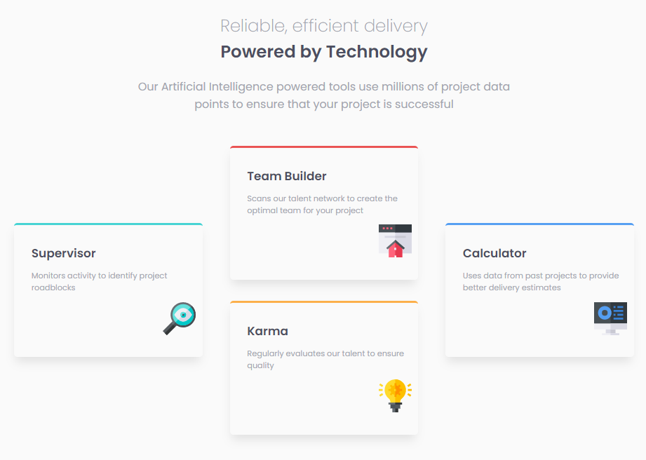
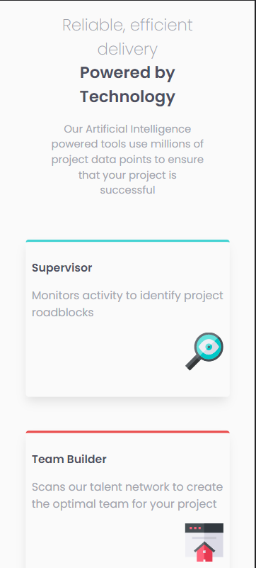

# Frontend Mentor - Four card feature section solution

This is a solution to the [Four card feature section challenge on Frontend Mentor](https://www.frontendmentor.io/challenges/four-card-feature-section-weK1eFYK). Frontend Mentor challenges help you improve your coding skills by building realistic projects.

## Table of contents

- [Overview](#overview)
  - [The challenge](#the-challenge)
- [My process](#my-process)
  - [Built with](#built-with)
  - [What I learned](#what-i-learned)
  - [Useful resources](#useful-resources)
  - [Solution](#solution)
  - [How to start](#how-to-start)

## Overview

### The challenge

Users should be able to:

- View the optimal layout for the site depending on their device's screen size

## My process

### Built with

- Semantic HTML5 markup
- CSS custom properties
- Flexbox
- [Lit](https://lit.dev/docs/) - Lit is a simple library for building fast, lightweight web components.

### What I learned

This challenge helped me understand Lit better. I also had the opportunity to organize my code better and learn more about naming conventions in CSS.

### Useful resources

- [The BEM Naming Convention](https://www.freecodecamp.org/news/css-naming-conventions-that-will-save-you-hours-of-debugging-35cea737d849/)
- [Flexbox guide](https://css-tricks.com/snippets/css/a-guide-to-flexbox/)

### Solution

Desktop:

Mobile:

### How to start

Run the following commands:
npm install
npm run
